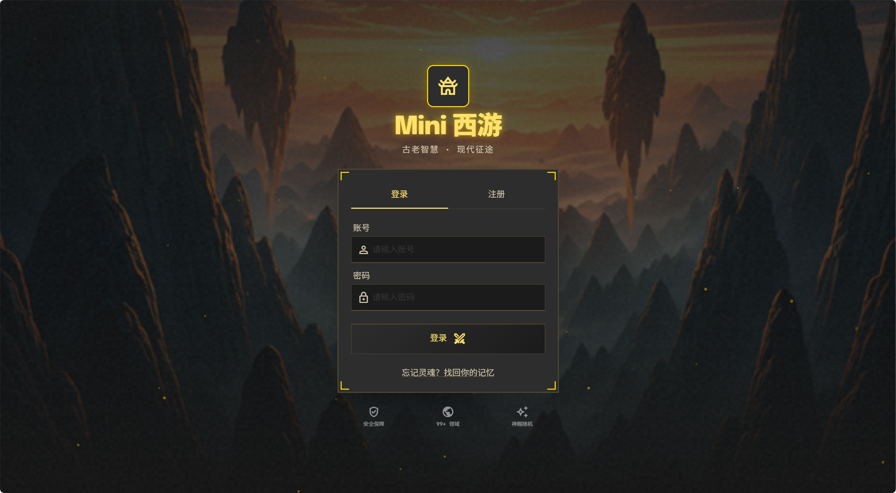
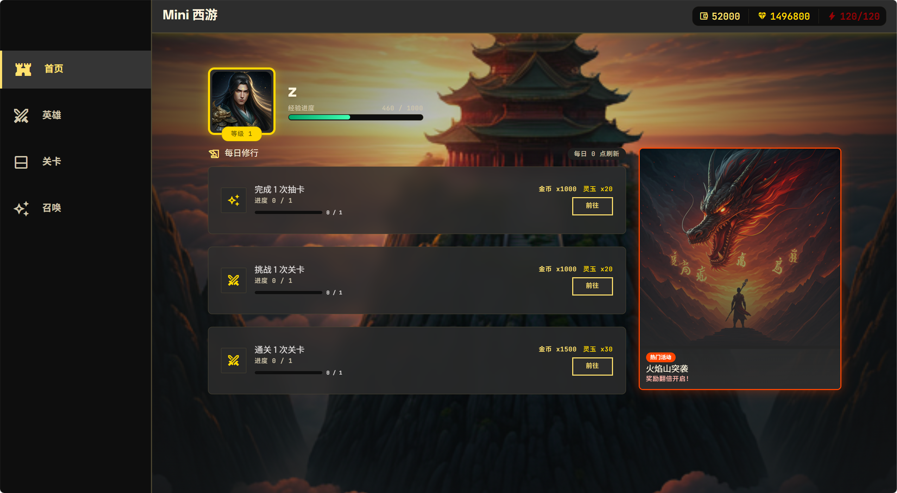
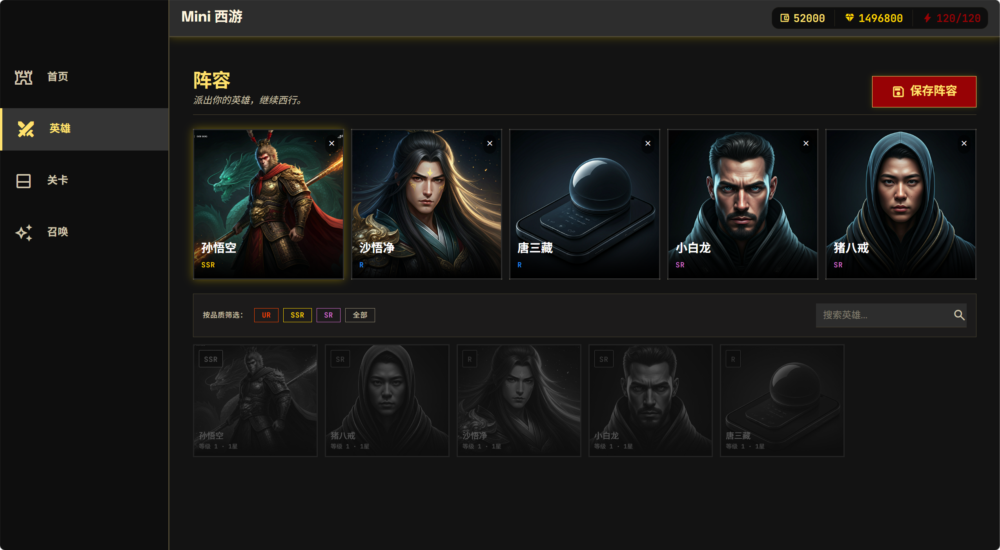
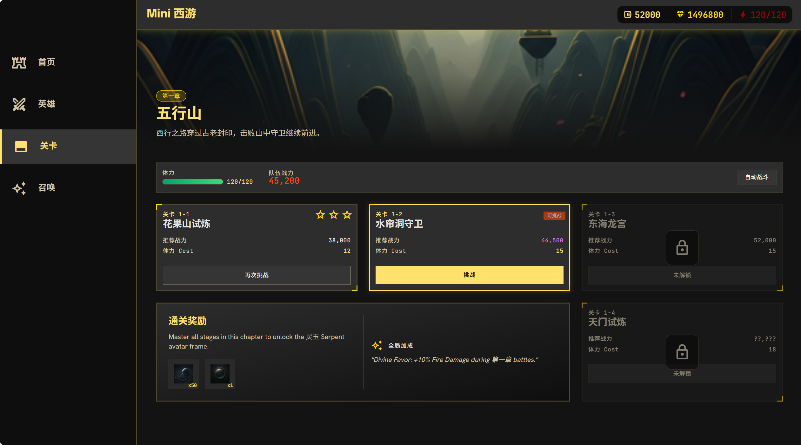
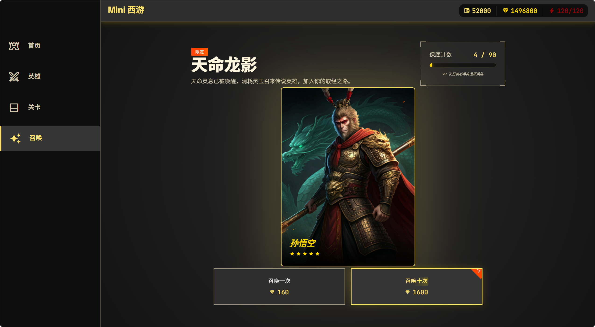
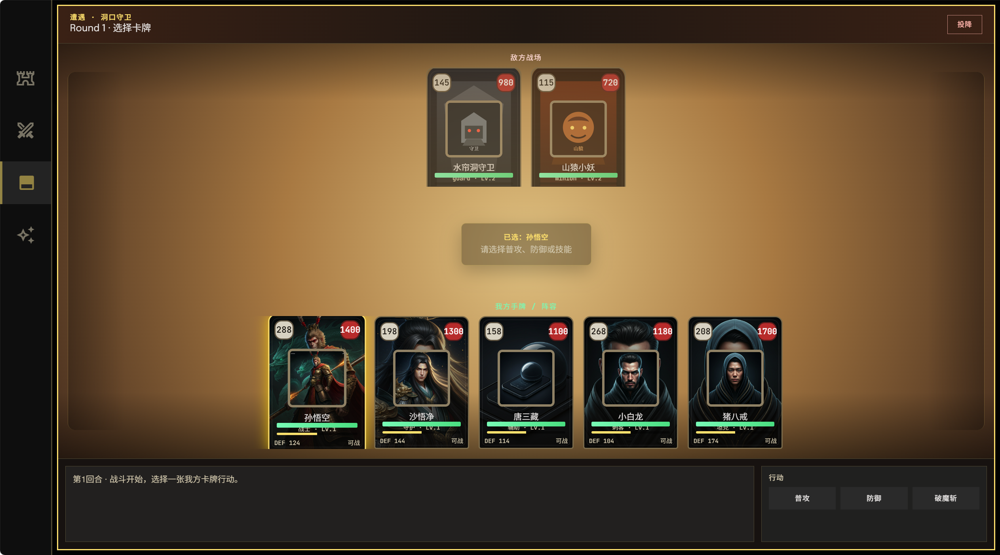

# Mini 西游

一个用 Go 实现的卡牌手游后端 Mini 项目，围绕西游题材搭建注册登录、JWT 鉴权、玩家资产、神将背包、抽卡保底、阵容保存、关卡结算、回合制战斗、日常任务和静态前端展示等核心玩法闭环。

项目适合用来练习 Go 游戏服务端的完整工程链路：请求进入 Gin 后，服务端完成参数校验、身份解析、读取配置、事务更新玩家数据、写入抽卡/战斗状态，并把结果返回给前端。

## 项目预览

登录 / 注册页：

<<<<<<< HEAD


主页与任务：


阵容编成：


关卡挑战：


抽卡界面：


战斗面板：


=======


主页与任务：



阵容编成：



关卡挑战：



抽卡界面：



战斗面板：


>>>>>>> feat/battle-board

## 功能特性

- 账号体系：注册、登录、密码哈希、JWT 签发与鉴权中间件。
- 玩家数据：玩家资料、金币、钻石、体力、体力恢复时间。
- 神将系统：静态神将配置、玩家神将背包、重复神将处理。
- 抽卡系统：单抽、十连、卡池状态、权重随机、保底计数、抽卡记录。
- 阵容系统：上阵位置校验、英雄归属校验、阵容保存与查询。
- 关卡系统：前置关卡校验、体力校验、服务端结算、奖励发放。
- 回合制战斗：战斗会话、行动提交、技能/普攻/防御、投降、战斗日志。
- 日常任务：任务进度更新、任务奖励领取、防重复领取。
- Docker 部署：应用、MySQL、Redis 一套 `docker compose` 启动。

## 技术栈

| 技术 | 用途 |
| --- | --- |
| Go 1.25 | 后端主语言 |
| Gin | HTTP 路由、JSON 接口、中间件 |
| GORM | MySQL 数据访问和 AutoMigrate |
| MySQL 8.0 | 用户、玩家、抽卡、阵容、关卡、战斗会话等持久化数据 |
| Redis 7.2 | 缓存/排行榜扩展预留，连接失败时应用可继续运行 |
| JWT | 无状态登录鉴权 |
| zap | 结构化日志 |
| Docker Compose | 本地和服务器依赖编排 |

## 快速开始

### 方式一：Docker Compose

推荐用 Docker Compose 启动完整环境，它会同时拉起应用、MySQL 和 Redis。

```bash
cd code/mini-card-game
cp .env.example .env
docker compose up -d --build
```

启动后访问：

```text
http://localhost:5290
```

健康检查：

```bash
curl http://localhost:5290/health
```


### 方式二：本地 Go 运行

本地运行需要先准备 MySQL 和 Redis，然后配置 `.env`。

```bash
cd code/mini-card-game
cp .env.example .env
```

示例 `.env`：

```env
APP_NAME=mini-card-game
APP_ENV=local
HTTP_ADDR=:5290
FRONTEND_DIST=frontend/stitch
MYSQL_DSN=root:mini_card_root_password@tcp(127.0.0.1:3306)/mini_card_game?charset=utf8mb4&parseTime=True&loc=Local
REDIS_ADDR=127.0.0.1:6379
REDIS_PASSWORD=
REDIS_DB=0
JWT_SECRET=change-this-to-a-long-random-string
JWT_EXPIRE_SECONDS=86400
```

运行服务：

```bash
go run ./cmd/server
```

服务启动时会执行 GORM AutoMigrate，并写入基础配置数据。`migrations/` 目录保留了建表 SQL，适合用于审阅数据库结构或生产环境变更管理。

## 配置项

| 变量 | 默认值 | 说明 |
| --- | --- | --- |
| `APP_NAME` | `mini-card-game` | 应用名称 |
| `APP_ENV` | `local` | 运行环境，影响日志格式 |
| `HTTP_ADDR` | `:5290` | HTTP 监听地址 |
| `FRONTEND_DIST` | `frontend/stitch` | 静态前端目录 |
| `MYSQL_DSN` | 空 | MySQL 连接串，应用启动必填 |
| `REDIS_ADDR` | `localhost:6379` | Redis 地址 |
| `REDIS_PASSWORD` | 空 | Redis 密码 |
| `REDIS_DB` | `0` | Redis DB 编号 |
| `JWT_SECRET` | 空 | JWT 签名密钥，部署前请改成长随机字符串 |
| `JWT_EXPIRE_SECONDS` | `86400` | Token 过期秒数 |

## 接口一览

统一响应格式：

```json
{
  "code": 0,
  "message": "success",
  "data": {}
}
```

### 公共接口

| 方法 | 路径 | 说明 |
| --- | --- | --- |
| `GET` | `/health` | 健康检查 |
| `POST` | `/api/v1/auth/register` | 注册账号并初始化玩家 |
| `POST` | `/api/v1/auth/login` | 登录并返回 JWT |

### 鉴权接口

请求头：

```text
Authorization: Bearer <token>
```

| 方法 | 路径 | 说明 |
| --- | --- | --- |
| `GET` | `/api/v1/player/profile` | 查询玩家资料 |
| `GET` | `/api/v1/player/assets` | 查询金币、钻石、体力 |
| `GET` | `/api/v1/heroes` | 查询玩家神将背包 |
| `GET` | `/api/v1/gacha/state?pool_id=1` | 查询卡池保底状态 |
| `POST` | `/api/v1/gacha/draw` | 单抽或十连抽 |
| `GET` | `/api/v1/team` | 查询当前阵容 |
| `POST` | `/api/v1/team/save` | 保存当前阵容 |
| `POST` | `/api/v1/stage/fight` | 简化关卡结算 |
| `POST` | `/api/v1/stage/battle/start` | 开始回合制战斗 |
| `POST` | `/api/v1/stage/battle/action` | 提交战斗行动 |
| `POST` | `/api/v1/stage/battle/surrender` | 投降并结束战斗 |
| `GET` | `/api/v1/tasks/daily` | 查询日常任务 |
| `POST` | `/api/v1/tasks/claim` | 领取日常任务奖励 |

### 调用示例

注册：

```bash
curl -X POST http://localhost:5290/api/v1/auth/register \
  -H "Content-Type: application/json" \
  -d '{"username":"test001","password":"123456","nickname":"小悟空"}'
```

登录：

```bash
curl -X POST http://localhost:5290/api/v1/auth/login \
  -H "Content-Type: application/json" \
  -d '{"username":"test001","password":"123456"}'
```

抽卡：

```bash
curl -X POST http://localhost:5290/api/v1/gacha/draw \
  -H "Content-Type: application/json" \
  -H "Authorization: Bearer <token>" \
  -d '{"pool_id":1,"times":10}'
```

开始战斗：

```bash
curl -X POST http://localhost:5290/api/v1/stage/battle/start \
  -H "Content-Type: application/json" \
  -H "Authorization: Bearer <token>" \
  -d '{"stage_id":1}'
```

## 业务流程

推荐体验顺序：

1. 注册账号：创建用户、玩家资料、初始资产和任务状态。
2. 登录账号：获取 JWT。
3. 查看任务：确认日常任务当前进度。
4. 抽卡：获得神将，同时推进抽卡任务。
5. 保存阵容：选择已拥有神将上阵。
6. 挑战关卡：消耗体力并获得奖励。
7. 开始回合制战斗：按行动提交普攻、技能、防御或投降。
8. 领取任务奖励：完成后领取金币和钻石。

## 项目结构

```text
mini-card-game/
  cmd/server/              # 程序入口
  internal/
    cache/                 # Redis 连接
    config/                # 环境变量配置
    handler/               # HTTP 入参、出参和错误映射
    middleware/            # JWT 鉴权
    model/                 # GORM 模型、AutoMigrate、基础数据 seed
    pkg/                   # 响应、错误码、JWT、日志、密码、随机权重工具
    repository/            # 数据访问封装
    router/                # 路由注册和依赖组装
    service/               # 业务规则、事务和流程编排
  frontend/stitch/         # 静态前端页面、截图和素材
  migrations/              # SQL 迁移文件
  deploy/                  # 服务器部署脚本和说明
  docker-compose.yml       # 应用 + MySQL + Redis 编排
  Dockerfile               # 应用镜像构建
  go.mod
```

## 数据与初始化

应用启动时会自动创建/更新表结构，并写入一组基础配置：

- 神将：孙悟空、猪八戒、沙悟净、小白龙、唐三藏。
- 卡池：天命召唤，支持权重随机和 90 抽保底。
- 关卡：花果山试炼、水帘洞守卫、东海龙宫。
- 敌人：山猿小妖、水帘洞守卫、东海虾兵、龙宫巡将。
- 技能：攻击、治疗、防御强化、攻击强化等基础技能。
- 日常任务：抽卡、挑战关卡、通关关卡。

`migrations/*.sql` 提供了从初始表到卡牌战斗表现的结构演进记录。生产环境可按迁移文件管理 schema，开发环境可直接依赖 AutoMigrate 快速启动。

## 部署

服务器安装 Docker 后，上传 `mini-card-game` 目录并执行：

```bash
cd /opt/mini-card-game
cp .env.example .env
docker compose up -d --build
```

如果部署在腾讯云等云服务器，请在安全组放行 TCP `5290` 端口。

也可以使用项目内脚本：

```bash
bash deploy/tencentcloud-quickstart.sh
```

更多命令见 [deploy/DOCKER_DEPLOY.md](deploy/DOCKER_DEPLOY.md)。

## 开发文档

- [需求文档](../../docs/requirements.md)：项目背景、模块划分、数据表和业务流程。
- [前端接口文档](../../docs/front.md)：前端对接字段、接口说明、枚举和状态机。
- [开发教程](../../docs/tutorial.md)：从零实现该后端项目的学习记录。

## 后续计划

- 补齐配置读取接口，例如神将图鉴、关卡配置、卡池配置和任务配置。
- 增加邮件补偿、排行榜查询、战斗回放和管理后台能力。
- 为抽卡、任务、阵容、关卡增加更完整的单元测试。
- 增加 OpenAPI/Swagger 文档，方便前后端联调。
